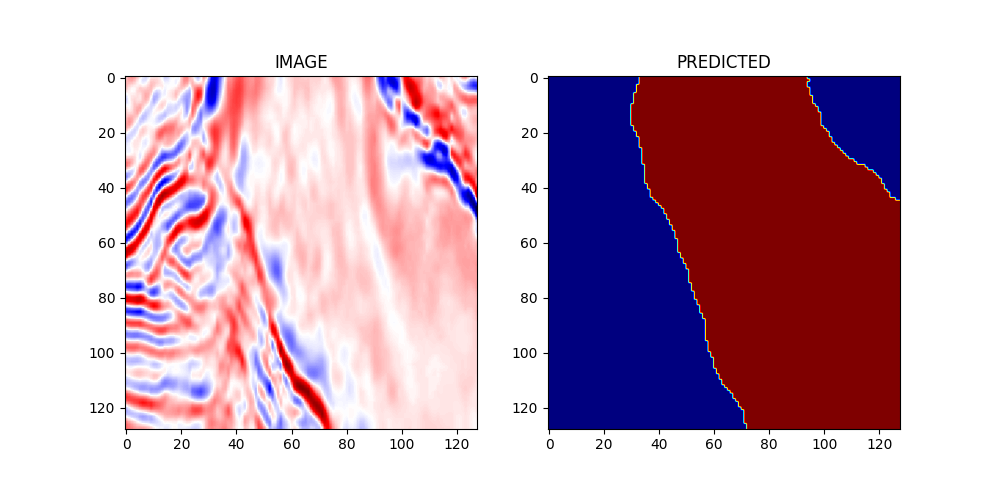

# Salt Segmentation with PyTorch

This project utilised the popular UNET CNN architecture to perform semantic segmentation of Salt dome in seismic data.

The data used was gotten from the TGS Salt Detection Challenge on Kaggle

To train the model, run;
> **!python script/train.py --num_epochs 5 --batch_size 64 --learning_rate 0.001**

To predict on any images, run;
> **!python script/predict.py --image_path './0bbee760e3.png' --image_name 'Mask'**

## Example

